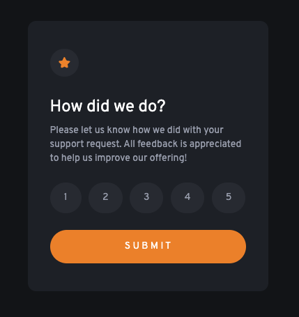
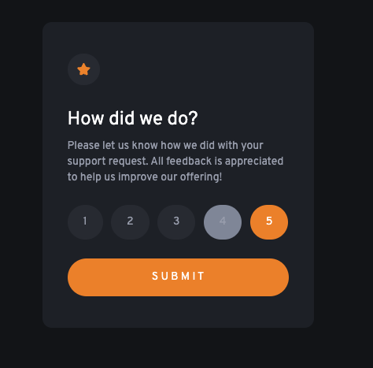
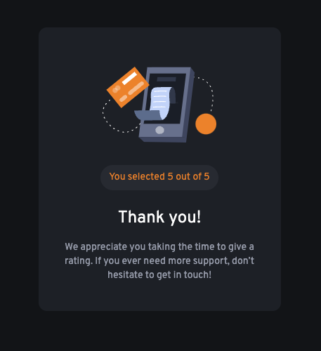

# Frontend Mentor - Interactive rating component solution

This is a solution to the [Interactive rating component challenge on Frontend Mentor](https://www.frontendmentor.io/challenges/interactive-rating-component-koxpeBUmI). Frontend Mentor challenges help you improve your coding skills by building realistic projects.

## Table of contents

- [Overview](#overview)
    - [The challenge](#the-challenge)
    - [Screenshot](#screenshot)
    - [Links](#links)
- [My process](#my-process)
    - [Built with](#built-with)
    - [What I learned](#what-i-learned)
- [Author](#author)

## Overview

### The challenge
t
Users should be able to:

- View the optimal layout for the app depending on their device's screen size
- See hover states for all interactive elements on the page
- Select and submit a number rating
- See the "Thank you" card state after submitting a rating

### Screenshot

### Links

- Solution URL: [frontendmentor.io/profile/sanderdechering](https://www.frontendmentor.io/profile/sanderdechering)
- Live Site URL: [sanderdechering.github.io/Frontend-mentor_rating-component/](https://sanderdechering.github.io/Frontend-mentor_rating-component/)

## My process

### Built with

- [Vite](https://vitejs.org/) - Build tool
- [Tailwind CSS](https://tailwindcss.com/) - Tailwind CSS
- [VueJS](https://vuejs.org/) - Vue framework

### What I learned

This is my third Frontend Mentor project. I used Tailwind CSS and Vue TS to create this project.
I'm currently trying to get better at Tailwind CSS. This was my first time using TypeScript in Vue JS.

## Author

- Website - [Sander Dechering](https://www.sanderdechering.nl)
- Frontend Mentor - [@sanderdechering](https://www.frontendmentor.io/profile/sanderdechering)